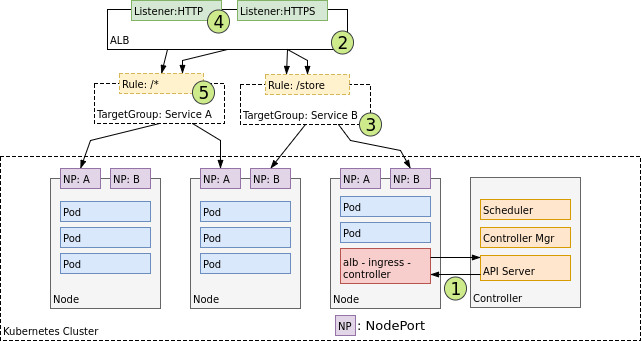

# Kubernetes-features
Kubernetes features including external dns and ALB integration

# This repository will help you to integrate Kubernetes with AWS and assign DNS to ALB mappings in Route53

## Please go through the [external-dns] (external-dns.yaml) file to make the necessary changes according to your infra

## Integrate External DNS into kubernetes and AWS:

```git clone https://github.com/chandraprakash1392/Kubernetes-features.git
cd Kubernetes-features/
kubectl create -f external-dns.yaml
```

This will enable external-dns and allow you to assign host names to services inside your Kubernetes Cluster

# How does an Nginx ingress controller work:


```
1. The ingress controller watches for ingress events from Kubernetes API.
2. An ALB is created in AWS to route all traffic to the kubernetes configured nodes
3. Once the controller finds an event from API, it sends the event information to the ALB, meanwhile it creates an ingress node in the same namespace in which the service is hosted
4. The default-backend-service keeps listening to traffic requests from ALB and routes the traffic according to the rules configured in ingress.yaml
```

## Create your ALB integration into Kubernetes:
```cd Kubernetes-features/
kubectl create -f default-backend-service.yaml
```
This will create the backend service for Nginx ingress controller.


```kubectl create -f alb-ingress-controller.yaml```
This will create the ALB ingress controller.

## Note:
``` These deployments are meant to be hosted only on the master node, else they will not function properly```